# Artifact 4
---

## Table of Contents

1. Introduction
2. Test Basis
3. Concept and Design Rationale
4. Coverage Item Identification
5. Coverage Strategy and Method
6. AutoTestDesign Generation and Review
7. Test Case Design
8. Traceability Matrix
9. Test Tool Implementation
10. Test Execution Results
11. Coverage Analysis
12. Evidence-based Improvement
13. Limitations and Residual Risks
14. Appendix A: Evidence File Index

## 1. Introduction

### 1.1 Purpose
本文档说明如何使用 AutoTestDesign 工具，对 VCU Wake-Sleep Behavior Simulator 的 **Module A 唤醒-休眠决策模块**完成详细测试设计、脚本实现、执行与结果分析。

### 1.2 Target Application and Selected Module

| Item | Description |
|---|---|
| Target Application | VCU Wake-Sleep Behavior Simulator, FastAPI service |
| Selected Module | Module A 唤醒-休眠决策状态机 |
| 状态 | state09 休眠 / state10 卡死 / state11 唤醒 |
| 7 路唤醒信号 | 供电电压 / CAN 报文 / CP / CC / CC2 / 口盖 / 门板 |
| 3 条休眠必要条件 | VCUIdle_flg h1 ∧ AuthComplete_flg h2 ∧ CAN stopped h3 |
| 输出 Oracle 字段 | vehicle_state, pdcu_wake_reason, result_type, bus_message_flag, actual_duration, active_dtcs … |
| 主接口 | `POST /simulate` |

**三套服务运行基线，Step 1**
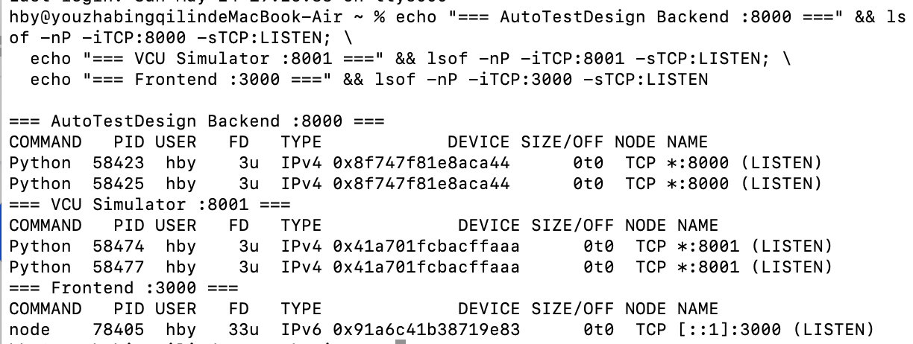

**VCU Simulator Swagger / OpenAPI**
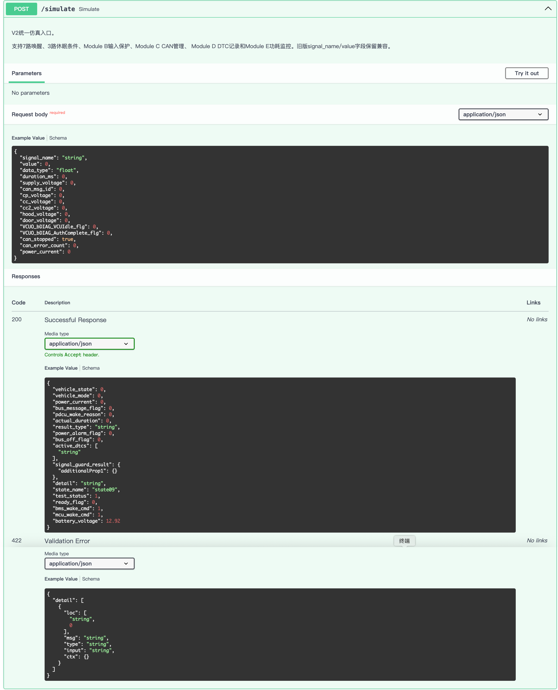

**AutoTestDesign 工具前端**
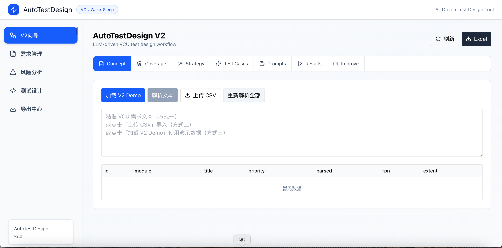

**`POST /simulate` 样例响应**
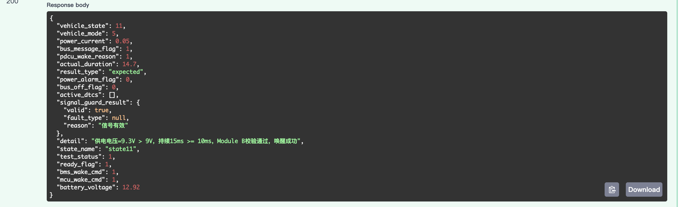

### 1.3 Scope

**In Scope**：Module A 的 7 路唤醒判定、3 条件休眠判定、卡死缺陷复现、状态迁移、输出字段一致性、时序合规、API/进程内 pytest 执行、需求→风险→覆盖项→用例→结果全链路追溯。

**Out of Scope**：真实 HIL/dSPACE、ASAM XCP 物理通信、CAN 物理层、1kHz 物理采样、真车路测；以及 **Module B/C/D/E**，包括过压/欠压保护、CAN 错误、DTC 清除和功耗告警等。

### 1.4 AutoTestDesign 人工在环工作流

本测试设计并非由 LLM 一次性生成并直接采用。AutoTestDesign 在每个关键阶段均采用 **“LLM 初稿生成 → 人工审查 → 修订确认 → 入库使用”** 的工作流，以保证测试设计结果始终以需求文档和课程测试设计原则为依据，而不是依赖未验证的 AI 输出。

在本次 Module A 测试设计中，LLM 主要承担需求结构化、风险初评、覆盖项草拟、测试策略建议和测试用例生成等辅助工作；测试人员则负责对照需求文档、仿真器接口和课程测试技术要求进行审查。所有最终用于测试执行的需求、风险、覆盖项、策略和测试用例，均经过人工复核后才进入后续阶段。

整个流程严格遵循自上而下的测试设计顺序：

```text
需求来源
→ 需求解析
→ 风险分析
→ 覆盖项识别
→ 测试策略分配
→ 测试用例设计
→ 测试执行
→ 结果分析与改进
```
本项目共记录了 16 项人工修订，编号为 REV-001~REV-016；另记录 8 项工具修复，编号为 TOOL-FIX-001~TOOL-FIX-008。这些修订覆盖了需求解析、风险评分、覆盖项补全、测试策略调整、测试用例审查、执行后纠正和基于证据的改进等阶段。关键修订摘要如下:

| # | 阶段 | LLM 草稿 | 人工在环修订 | REV-ID | 证据章节 |
|---|---|---|---|---|---|
| 1 | 需求解析 | 14 条结构化需求，含 6 处错误或遗漏 | 删伪输入 / 补时序双条件 / 补维持分支 / 拆复合条件 / 条件式 oracle | REV-001~005 | §2.2 |
| 2 | 风险分析 | 14 条 RPN，其中 2 处低估 High 需求 | REQ-008/009 RPN 8/6 → 2，提到 Extensive | REV-009/010 | §2.4 |
| 3 | 覆盖项识别 | 14 条 Input 类 CI | 补 Output/Behavior/Environment **+8 → 22** | REV-006~008 | §4 |
| 4 | 覆盖策略 | 自动推断，多数需求只绑定单一技术 | 按课件 §STP-5.8 映射表补多技术绑定 | REV-011 | §5 |
| 5 | 用例设计 | 94 条，含 21 个臆造字段和系统性 oracle 取值错误 | 两轮 prompt 改进 + 设计期审查，执行改、删、补 | REV-012~015 | §6 / §7 |
| 6 | 执行后修订 | 执行后暴露的偏差 | REV-016 改 3、删 4、加 1，并修复 adapter | REV-016 | §10.4 |
| 7 | 基于证据的改进 | 8 条 LLM 增广建议 | 人工评审后采纳 3 条，并根据覆盖缺口补 1 条 | §12 | §12 |

该流程确保测试用例不是需求的替代来源，而是需求分析、风险评估和覆盖设计之后的派生产物。需求文档始终位于测试设计链路的起点，测试用例位于链路末端；LLM 输出仅作为草稿和建议，最终测试资产均经过人工验证后才用于执行和报告。


---

## 2. Test Basis


### 2.1 需求来源与选定模块需求

本 Artifact 4 的目标应用是 **VCU Wake-Sleep Behavior Simulator**，选定的主要模块是 **Module A — Wake-Sleep Decision Module**，测试范围覆盖 **REQ-001~REQ-014**。

这些 Module A 需求来源于前期客户需求文档，并在项目中整理为 VCU 仿真器的需求基线。由于本 Artifact 作为独立提交的详细测试设计与执行文档，评阅者无法依赖其他项目内部文档，因此本文在此处重新列出本次测试使用的完整需求范围，使后续测试设计、覆盖分析和执行结果具备自包含的测试依据。
| REQ ID | Functional Area | Requirement / Expected Behavior | Main Observable Oracle |
|---|---|---|---|
| REQ-001 | Wake trigger w1 | If `supply_voltage > 9.0V` and `duration_ms >= 10ms`, the VCU shall wake up through hardwire supply wake. | `vehicle_state=11`, `pdcu_wake_reason=1` |
| REQ-002 | Wake trigger w2 | If `can_msg_id` is within `[0x400, 0x47F]`, the VCU shall wake up through CAN network wake. | `vehicle_state=11`, `pdcu_wake_reason=2` |
| REQ-003 | Wake trigger w3 | If `cp_voltage > 9.0V`, the VCU shall wake up through CP signal wake. | `vehicle_state=11`, `pdcu_wake_reason=3` |
| REQ-004 | Wake trigger w4 | If `cc_voltage < 4.4V`, the VCU shall wake up through CC signal wake. | `vehicle_state=11`, `pdcu_wake_reason=4` |
| REQ-005 | Wake trigger w5 | If `cc2_voltage < cc2_ubr_threshold` where the default threshold is `4.4V`, the VCU shall wake up through CC2 signal wake. | `vehicle_state=11`, `pdcu_wake_reason=5` |
| REQ-006 | Wake trigger w6 | If `hood_voltage > 4.0V` and `duration_ms >= 10ms`, the VCU shall wake up through hood signal wake. | `vehicle_state=11`, `pdcu_wake_reason=6` |
| REQ-007 | Wake trigger w7 | If `door_voltage < 1.0V` and `duration_ms >= 10ms`, the VCU shall wake up through door signal wake. | `vehicle_state=11`, `pdcu_wake_reason=7` |
| REQ-008 | Sleep condition h1 | `VCUO_bDIAG_VCUIdle_flg=1` is a necessary condition for entering sleep. | Used as one input condition for REQ-011 |
| REQ-009 | Sleep condition h2 | `VCUO_bDIAG_AuthComplete_flg=1` is a necessary condition for entering sleep. | Used as one input condition for REQ-011 |
| REQ-010 | Sleep condition h3 | `can_stopped=true` is a necessary condition for entering sleep. | Used as one input condition for REQ-011 |
| REQ-011 | Sleep conjunction | The VCU shall enter `state09` only when h1, h2, and h3 are all satisfied; otherwise it shall remain outside sleep. | `vehicle_state=9` when all true; `vehicle_state != 9` otherwise |
| REQ-012 | Stuck fault scenario | Rapid wake-sleep cycles shall trigger the known `state10` stuck condition and record `DTC_001`. | `vehicle_state=10`, `active_dtcs` contains `DTC_001` |
| REQ-013 | Output consistency | When the VCU is in `state11`, `bus_message_flag` shall be `1`; when it is in `state09`, `bus_message_flag` shall be `0`. | `bus_message_flag` matches the vehicle state |
| REQ-014 | Timing compliance | For type1 requests, `actual_duration` shall be `<=20s`; for type2 requests, `actual_duration` shall be `<=60s`. | `actual_duration` within the required limit |

### 2.2 需求解析与人工修订

AutoTestDesign 首先通过 `parse` prompt 将 §2.1 中的 14 条 Module A 需求结构化为 JSON 需求对象，原始文件为 `01_parsed_requirements_raw.json`。测试人员随后对照需求说明和 VCU Simulator 的可观察输入/输出字段进行审查，发现若干字段、时序条件和 oracle 表达问题，并在进入后续测试设计前完成 REV-001~005 修订：

| REV | REQ | LLM 草稿 | 人工修订 | 依据 / 不改的后果 |
|---|---|---|---|---|
| REV-001 | REQ-005 | 把 `ubr_threshold` 当成 test input 字段 | 删除该字段。它是 `/config` 常量，默认 4.4V，不是 simulate 入参 | 否则 EP/BVA 会产生 `ubr_threshold=14.5V` 这种纯噪声用例 |
| REV-002 | REQ-006/007 | 电压字段 `has_timing = False` | 改为 **True**，体现电压与时序双重判断 | 否则下游 BVA 只生成电压一维边界、漏掉 duration<10ms 用例 |
| REV-003 | REQ-011 | 只写"三条件全满足→state9"正向 oracle | 补充任一不满足时维持当前态，断言为 `vehicle_state ne 9` | 决策表 8 行里有 7 行会被判错 |
| REV-004 | REQ-012 | 把"次数≥3 AND 间隔<1s"压成单个 threshold=3 | 拆成次数和时序间隔两条独立 condition | 否则 BVA 看不到 interval 边界 0.9/1.0/1.1s，漏卡死关键用例 |
| REV-005 | REQ-013 | 同字段 `bus_message_flag` 同时 eq1/eq0，oracle 互斥 | 改为条件式 oracle：state11→flag=1 / state9→flag=0 | 否则用例生成不知两个值各对应哪种输入 |

**需求解析 Before / After 截图**：5 组截图证明 §2.3 的 14 条规则是人工审查后的版本。

| REV | Before | After |
|---|---|---|
| REV-001，REQ-005 删 ubr_threshold | 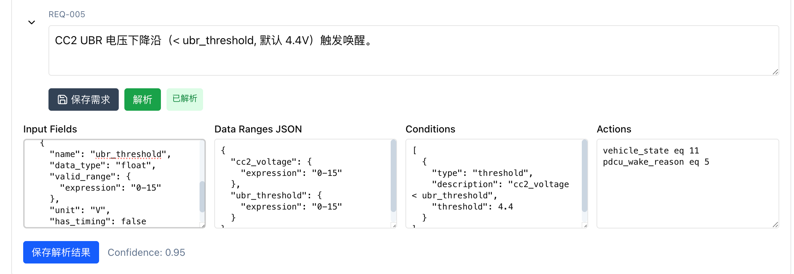 | 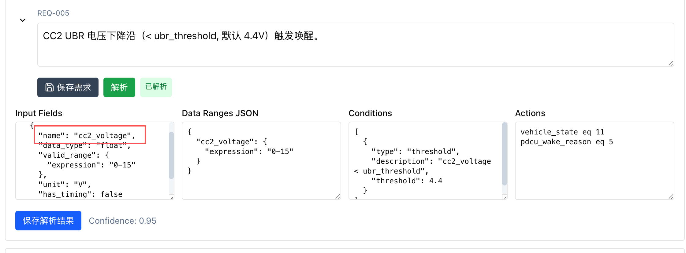 |
| REV-002，REQ-006/007 修正 has_timing | 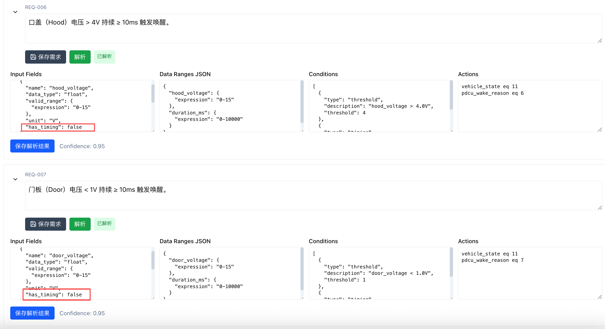 | 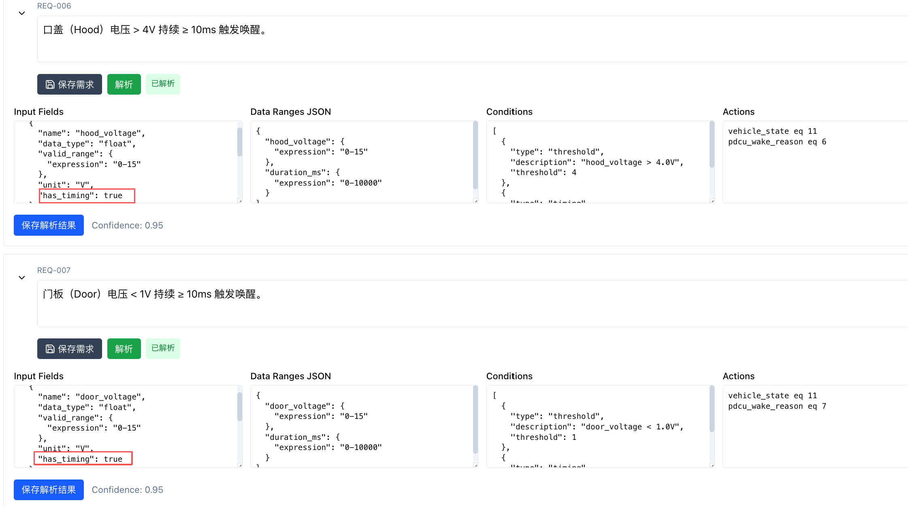 |
| REV-003，REQ-011 补维持分支 | 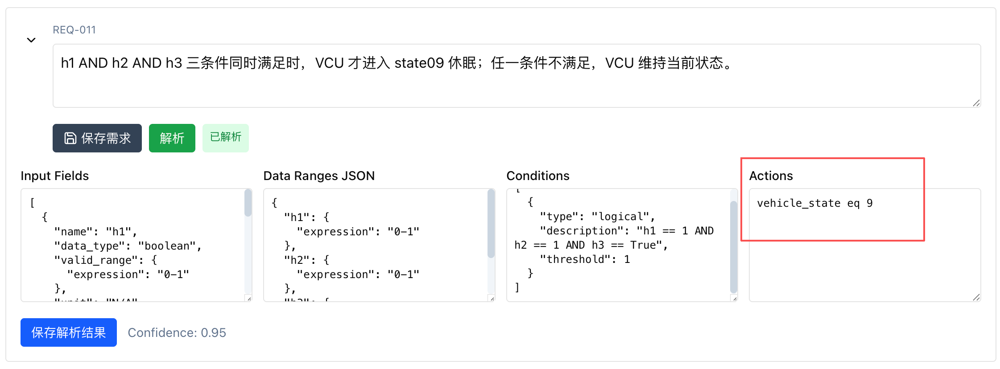 | 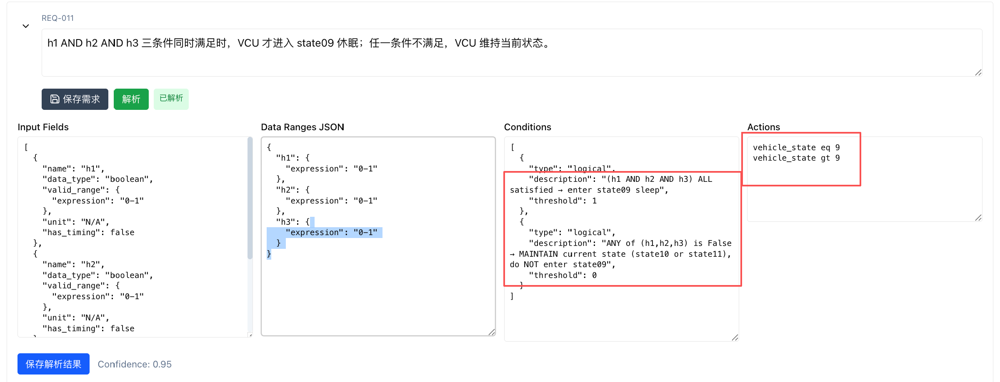 |
| REV-004，REQ-012 拆复合条件 | 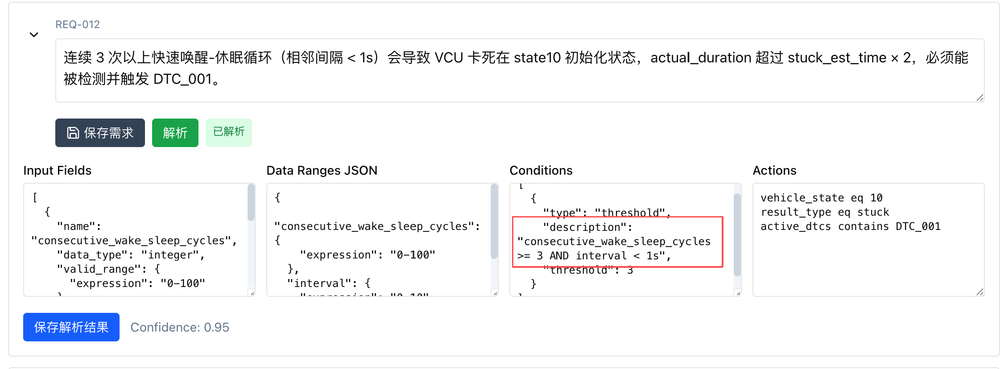 | 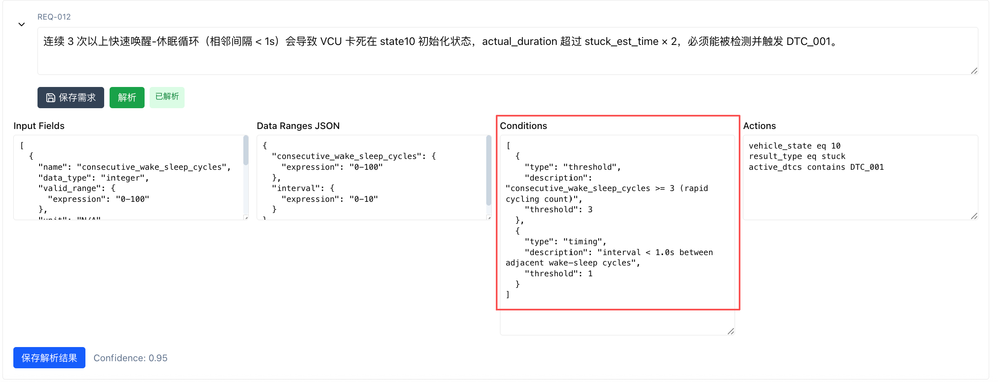 |
| REV-005，REQ-013 条件式 oracle | 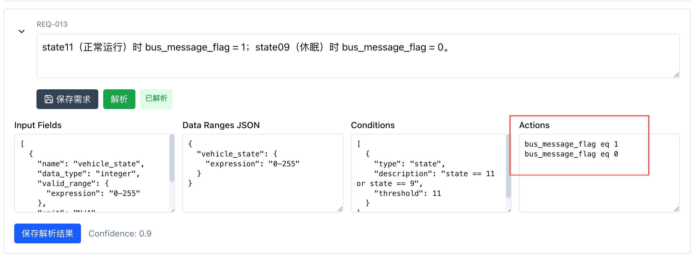 | 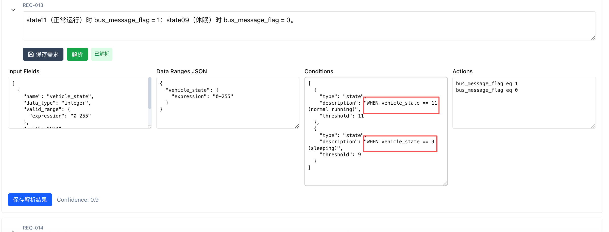 |

**需求解析原始输出，LLM raw**
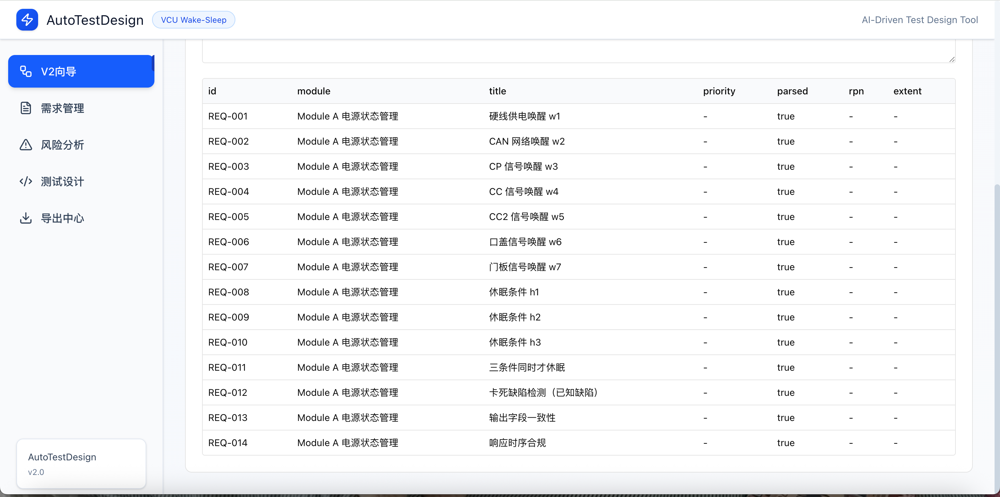

上述修订保证 §2.3 中的受测规则为人工审查后的需求基线，而不是未验证的原始解析结果。

### 2.3 Functional Rules Under Test

> 下表为经 §2.2 的 REV-001~005 修订后的最终受测规则，而不是 LLM 原始解析输出。

| REQ | 描述 | 期望 Oracle | 优先级 |
|---|---|---|---|
| REQ-001 | 供电电压 >9.0V 且持续 ≥10ms 唤醒 | vehicle_state=11, reason=1 | High |
| REQ-002 | CAN ID ∈ [0x400,0x47F] 唤醒 | vehicle_state=11, reason=2 | High |
| REQ-003 | CP 幅值 >9V 唤醒 | vehicle_state=11, reason=3 | Medium |
| REQ-004 | CC 电压 <4.4V 唤醒 | vehicle_state=11, reason=4 | Medium |
| REQ-005 | CC2 UBR <4.4V 唤醒 | vehicle_state=11, reason=5 | Medium |
| REQ-006 | 口盖 >4V 且 ≥10ms 唤醒 | vehicle_state=11, reason=6 | Low |
| REQ-007 | 门板 <1V 且 ≥10ms 唤醒 | vehicle_state=11, reason=7 | Low |
| REQ-008 | h1，即 VCUIdle_flg=1，是休眠必要条件 | — | High |
| REQ-009 | h2，即 AuthComplete_flg=1，是休眠必要条件 | — | High |
| REQ-010 | h3，即 CAN stopped，是休眠必要条件 | — | High |
| REQ-011 | h1∧h2∧h3 同时满足才 state09，否则维持 | vehicle_state=9 / ne 9 | High |
| REQ-012 | **连续≥3 次快速循环 → state10 卡死 + DTC_001，已知缺陷** | vehicle_state=10, DTC_001, dur=41s | **High，RPN=1** |
| REQ-013 | state11→bus_message_flag=1；state09→0 | 条件式 oracle | Medium |
| REQ-014 | type1 ≤20s；type2 ≤60s 时序合规 | actual_duration lte | Medium |

### 2.4 风险分析与人工修订

14 条结构化需求经 `risk` prompt 进行 ISO 9126 与 Tech Risk × Business Risk 风险评分，初始结果保存在 `05_risk_analysis_raw.json`。人工复核后确认大部分评分可作为测试设计输入，其中 REQ-012 卡死缺陷被评为 RPN=1，符合其已知缺陷和状态机失效影响。复核过程中发现 REQ-008 和 REQ-009 的风险被低估，因此完成 REV-009/010 修订：

| REV | REQ | LLM 草稿 RPN | 人工修订 RPN | 依据 |
|---|---|---|---|---|
| REV-009 | REQ-008，休眠 h1 | 8，tech4×bus2，Broad | **2，tech2×bus1，Extensive** | h1=VCUIdle_flg 是休眠必要条件，§2.8 标 **High**；该休眠不休眠→电池耗尽、不该休眠却休眠→行车断电，业务风险 Very High |
| REV-010 | REQ-009，休眠 h2 | 6，tech3×bus2，Broad | **2，tech2×bus1，Extensive** | h2=AuthComplete_flg 同 h1，须与 REQ-010/011 同享 Extensive 测试深度，否则休眠 AND 逻辑决策表覆盖出现优先级断层 |

**最终 RPN 分布**：Extensive 覆盖 RPN 1~5，共 7 条；Broad 覆盖 RPN 6~10，共 7 条。其中 RPN≤2 的重点需求为 REQ-001、REQ-008、REQ-009、REQ-010、REQ-011 和 REQ-012。该 RPN 用于驱动 §8 追溯矩阵中的优先级列、§10 的执行顺序和 §10.5 的测试套件优先级排序。

**风险分析 Before / After 截图，REV-009/010**

| Before | After |
|---|---|
| 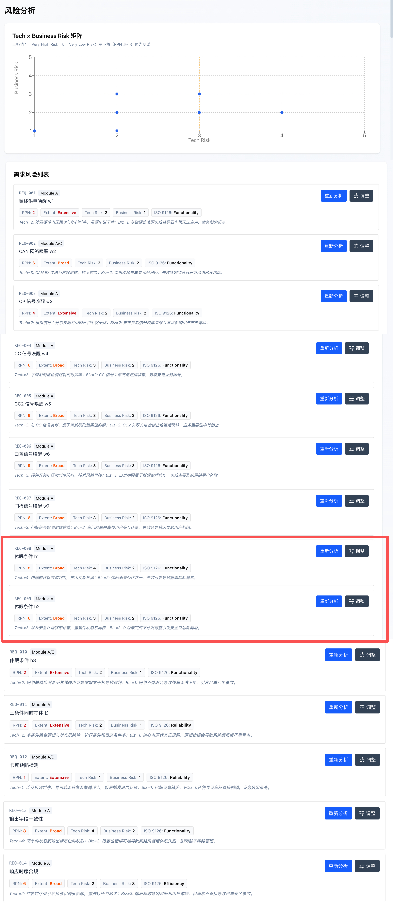 | 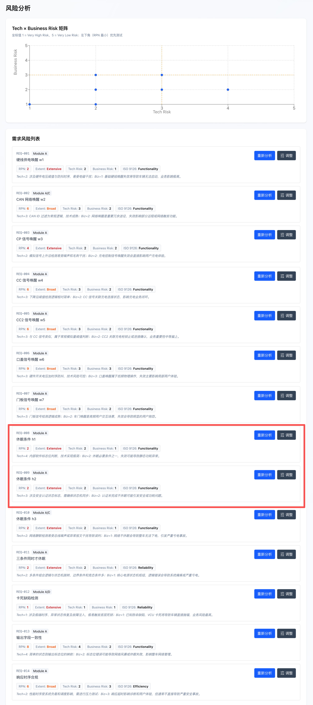 |


---

## 3. Concept and Design Rationale

### 3.1 Testing Concept Applied
- **Risk-based testing**：按 RPN 排序，RPN=1 的 REQ-012 卡死场景最先测试，详见 §10 和 FR7 优先级排序。
- **Coverage item** 表示可验证的测试覆盖目标，详见 §4。
- **Traceability matrix** 连接 REQ→风险→覆盖项→用例→结果，详见 §8。
- **AutoTestDesign** 支持设计自动化和人工交互式审查，详见 §6。

### 3.2 Black-box Techniques

| 技术 | 选用理由 | 应用于 |
|---|---|---|
| Equivalence Partitioning, EP | 唤醒信号有有效、无效和特殊等价类 | REQ-001~010、REQ-013 |
| Boundary Value Analysis, BVA | 电压和时序阈值易出现 off-by-one 问题；每个边界取三点并覆盖无效类 | REQ-001~007、REQ-014 |
| Decision Table, DT | h1∧h2∧h3 是三布尔组合，需要 2³ 全枚举 | REQ-008~011 |
| Scenario, SC | 卡死是多步序列而非单点输入 | REQ-012 |

### 3.3 White-box Technique
- **State Transition Testing**：Module A 本质是一台有限状态机，包含 state09 休眠、state11 唤醒和 state10 卡死三种状态。其输出强依赖"当前状态 + 事件"，最适合用状态迁移建模。覆盖准则取 **All-States**，这是 FR 4.0 的必需项；同时额外做到 **All-Transitions** 和 0-switch 覆盖，REQ-012 卡死序列再提供 1-switch。详见 §11.4。

> **黑盒 + 白盒互补性分析**：黑盒技术 EP/BVA/DT/SC 从需求规格角度切分输入空间，保证每条需求的有效、无效、边界和组合情形都被测试；白盒 ST 从实现状态角度验证状态机每个状态与迁移。两者交叉验证。例如 REQ-001 既有 9.0V 阈值三点的 BVA 边界用例，又有 state09→state11 的 ST 迁移用例，同一需求被两个视角覆盖，降低漏测风险。这也是 Assignment 要求 multiple black-box and white-box testing 的用意。

---

## 4. Coverage Item Identification

> Coverage Item 在 AutoTestDesign 的 Coverage 页维护，技术归属见 §5 Strategy 总览。初始覆盖项主要集中在输入条件，人工审查后补充 Output、Behavior 和 Environment 三类覆盖目标，使 Coverage Item 从 14 条扩展到 22 条，相关修订为 REV-006~008。

**22 条 Module A Coverage Items**：数据来源为 `_state_snapshot/coverage_items.json`。

| # | REQ | 技术 | ISO 9126 | Coverage Item |
|---|---|---|---|---|
| 1 | REQ-001 | BVA | Functionality | 硬线供电唤醒边界值测试 |
| 2 | REQ-002 | BVA | Functionality | CAN 网络唤醒报文 ID 边界测试 |
| 3 | REQ-003 | BVA | Functionality | CP 信号唤醒电压边界测试 |
| 4 | REQ-004 | BVA | Functionality | CC 信号唤醒电压边界测试 |
| 5 | REQ-005 | BVA | Functionality | CC2 信号唤醒电压边界测试 |
| 6 | REQ-006 | BVA | Functionality | 口盖信号唤醒电压与时间边界测试 |
| 7 | REQ-007 | BVA | Functionality | 门板信号唤醒电压与时间边界测试 |
| 8 | REQ-008 | EP | Functionality | 休眠条件 h1 状态等价类测试 |
| 9 | REQ-009 | EP | Functionality | 休眠条件 h2 状态等价类测试 |
| 10 | REQ-010 | EP | Functionality | 休眠条件 h3 CAN 总线空闲状态测试 |
| 11 | REQ-011 | DT | Functionality | 三条件组合休眠判定表测试 |
| 12 | REQ-012 | SC | Reliability | 快速唤醒休眠循环卡死缺陷场景测试 |
| 13 | REQ-013 | ST | Functionality | 电源状态与总线报文标志位状态转换测试 |
| 14 | REQ-014 | BVA | Efficiency | 响应时序合规性边界值测试 |
| 15 | REQ-001 | EP | Functionality | Output: vehicle_state 唤醒/休眠 oracle 一致性 |
| 16 | REQ-001 | EP | Functionality | Output: pdcu_wake_reason 来源编码 oracle |
| 17 | REQ-013 | DT | Functionality | Output: bus_message_flag 与 vehicle_state 一致性 |
| 18 | REQ-014 | BVA | Efficiency | Output: actual_duration 时序边界 oracle |
| 19 | REQ-012 | SC | Reliability | Output: active_dtcs 卡死时包含 DTC_001 |
| 20 | REQ-001 | ST | Functionality | Behavior: 正常唤醒序列 state09→state11 |
| 21 | REQ-012 | SC | Reliability | Behavior: 连续 3 次快速循环触发 state10 的卡死序列 |
| 22 | REQ-001 | EP | Functionality | Environment: VCU 仿真器 v1.0 SIL 环境基线 |

技术分布：BVA 9 / EP 6 / SC 3 / DT 2 / ST 2；类别：Input 14 + Output 5 + Behavior 2 + Environment 1。

**分析**：初始 14 条覆盖项主要关注输入边界，尚不足以支撑可执行 oracle、状态序列和环境前提的完整测试设计。人工评审据此补充 **8 条覆盖项**。其中 5 条 Output 覆盖 vehicle_state、pdcu_wake_reason、bus_message_flag 与状态一致性、actual_duration、active_dtcs 包含 DTC_001，用于明确通过/失败判定；2 条 Behavior 覆盖正常唤醒序列和卡死序列，用于支撑白盒状态迁移测试和场景测试；1 条 Environment 覆盖 SIL 环境基线，用于说明测试执行环境前提。补充后的 22 条覆盖项为 §7 的测试用例设计和 §11 的覆盖分析提供了完整依据。

**人工补全 Coverage Items：Before 14 → After 22**
| Before | After |
|---|---|
| 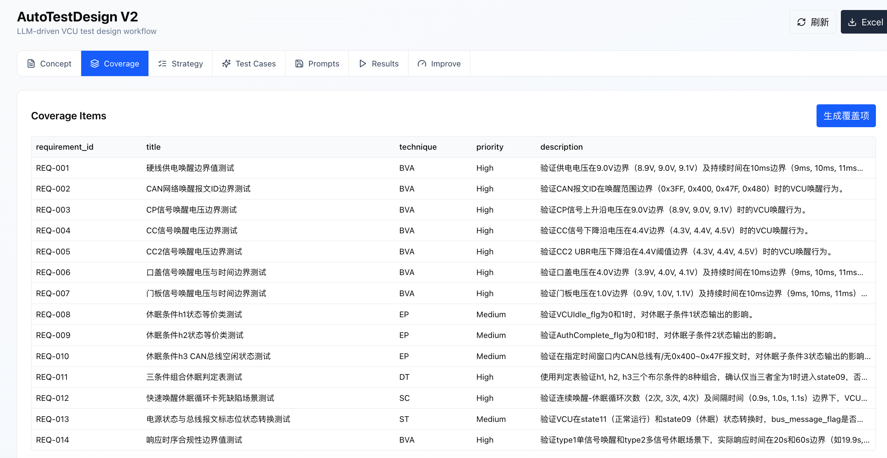 | 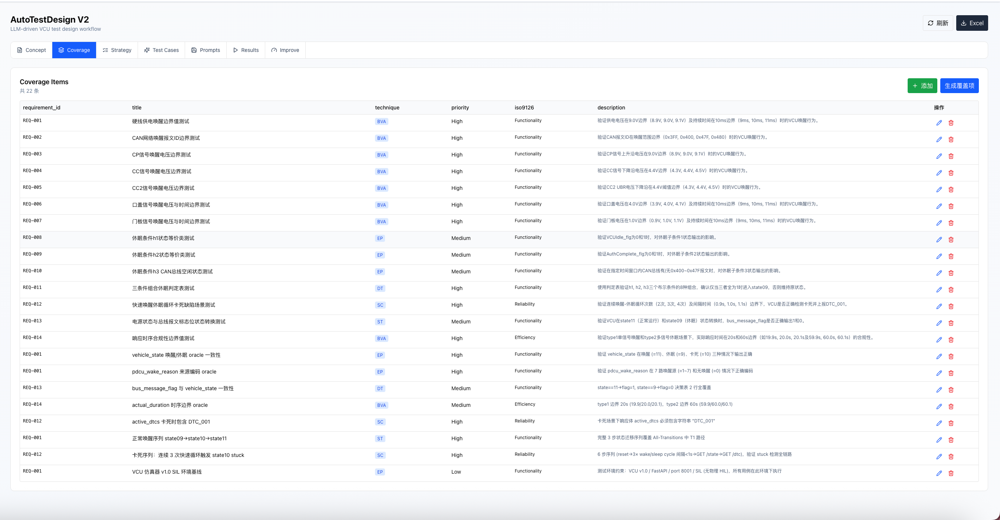 |

---

## 5. Coverage Strategy and Method

> Strategy 页维护每条需求的技术集合和 rationale。初始策略由 `ensure_strategy` 根据该需求 Coverage Items 的技术集合自动推断，随后人工按课件 §STP-5.8 映射表完成 REV-011 修订。策略数据与 coverage_items 分离，存储在 `strategies.json`。

| REQ | 技术 | Rationale 节选 |
|---|---|---|
| REQ-001 | EP;BVA;ST | 输入域等价类 + 9V&10ms 时序边界 + state09→state11 迁移 |
| REQ-002 | EP;ST | CAN ID 范围等价类 + 唤醒迁移 |
| REQ-003~005 | EP;ST | 输入域等价类 + 状态迁移 |
| REQ-006/007 | EP;BVA;ST | 带时序唤醒：等价类 + duration≥10ms 边界 + 迁移 |
| REQ-008~010 | DT;ST | 布尔条件决策表 + state11→state09 迁移 |
| REQ-011 | DT;ST | h1∧h2∧h3 的 2³ 决策表全枚举 + 迁移 |
| REQ-012 | ST;SC | 状态迁移 + 快速 3 次循环序列复现 DEF-001 |
| REQ-013 | EP | bus_message_flag 输出域等价类 |
| REQ-014 | BVA | actual_duration 时序边界 |

技术覆盖 **EP/BVA/DT/ST/SC 五种齐全**，包括 4 种黑盒技术和 1 种白盒技术。

### 5.1 策略人工修订

工具初版 strategy 由后端 `ensure_strategy` 从各需求已有 Coverage Item 的 technique 字段**自动推断**，结果偏单一，多数需求只挂 1 个技术。人工按课件 §STP-5.8「需求 ↔ 黑盒/白盒技术」映射表逐条修订为多技术组合，14 条需求均完成修改：

| REQ | Before | After | 修订原因 |
|---|---|---|---|
| REQ-001 | EP;BVA | **EP;BVA;ST** | 补 ST：w1 唤醒涉及 state09→state11 迁移，需 All-Transitions 覆盖 |
| REQ-002 | BVA | **EP;ST** | CAN ID 是离散范围，EP 比 BVA 更对口 + 唤醒迁移 |
| REQ-003 | BVA | **EP;ST** | CP 幅值等价类 + 状态迁移 |
| REQ-004 | BVA | **EP;ST** | w4 输入等价类 + 状态迁移 |
| REQ-005 | BVA | **EP;ST** | w5 输入等价类 + 状态迁移 |
| REQ-006 | BVA | **EP;BVA;ST** | 带时序唤醒：保留 duration≥10ms 的 BVA 边界，并补 EP + ST |
| REQ-007 | BVA | **EP;BVA;ST** | 同 REQ-006，带时序双条件 |
| REQ-008 | EP | **DT;ST** | 休眠 h1 是布尔条件 → 决策表 + 状态迁移 |
| REQ-009 | EP | **DT;ST** | 休眠 h2：决策表 + 状态迁移 |
| REQ-010 | EP | **DT;ST** | 休眠 h3：决策表 + 状态迁移 |
| REQ-011 | DT | **DT;ST** | h1∧h2∧h3 保留 DT 完成 2³ 全枚举，并补 ST |
| REQ-012 | SC | **ST;SC** | 已知卡死缺陷：保留 SC 场景序列，并补 ST 验证 state10 |
| REQ-013 | ST | **EP** | bus_message_flag 输出一致性改为输出域等价类，EP 比 ST 更准确 |
| REQ-014 | BVA | **BVA** | actual_duration≤20s 时序边界保持；AutoTestDesign 工具自身性能度量另存 `nfr_performance.md` |

> Strategy 存储与 coverage_items 分离，文件为 `strategies.json`。策略修订的 Before/After 证据保存在 `07_strategy_assignment_before.csv` 和 `07_strategy_assignment.csv`。
---

## 6. AutoTestDesign Generation and Review

AutoTestDesign 用 5 个结构化 prompt 支持测试设计流程：`parse` 负责需求解析，`risk` 负责风险分析，`coverage` 负责覆盖项识别，`testcase` 负责测试用例与 oracle 生成，`improve` 负责执行后的用例增广建议。正文只保留与测试设计质量直接相关的约束和审查结果；完整 prompt 文本见 `docs/test_evidence/prompts_used.md`。

所有 prompt 均要求返回 JSON，并使用固定 schema。测试用例阶段额外限制 oracle operator 为 `eq/ne/gte/lte/gt/lt/contains`，并要求 expected output 只能使用 VCU 仿真器真实返回字段，例如 `vehicle_state`、`pdcu_wake_reason`、`actual_duration`、`bus_message_flag` 和 `active_dtcs`。这些约束保证生成结果可以被脚本解析、人工审查并最终执行。

### 6.1 testcase prompt 两轮迭代

testcase prompt 依据设计期审查和执行反馈进行了两轮改进。改进重点放在生成规则上，而不是对单条用例做零散补丁：

| 版本 | 改进 | 修复的问题 | 量化效果 | 存档 |
|---|---|---|---|---|
| v1 | 仅字段列表 | — | 含臆造字段 21 条 + oracle 取值系统性错误 | `prompt_testcase_before.json` |
| v2，REV-015 | + 字段名白名单、禁止臆造、active_dtcs 用 contains | VCU 不返回 `is_compliant` / `sleep_sub_condition_*` / `Next_State` 等字段，导致 Untestability | 臆造字段 **21 → 0** | `prompt_testcase_v2_fieldwhitelist.json` |
| **v3，TOOL-FIX-007** | + **VCU 输出取值语义**，例如 state∈{9,10,11}、result_type∈{expected,error} | 系统性 oracle 取值错误，包括 state=0 幻觉、维持态写 10、no-wake 写 expected、卡死写 stuck | 执行通过率 **48/96 → 80/99** | `prompt_testcase_v3_value_semantics.json` |

**testcase prompt 改进后 v3 截图**
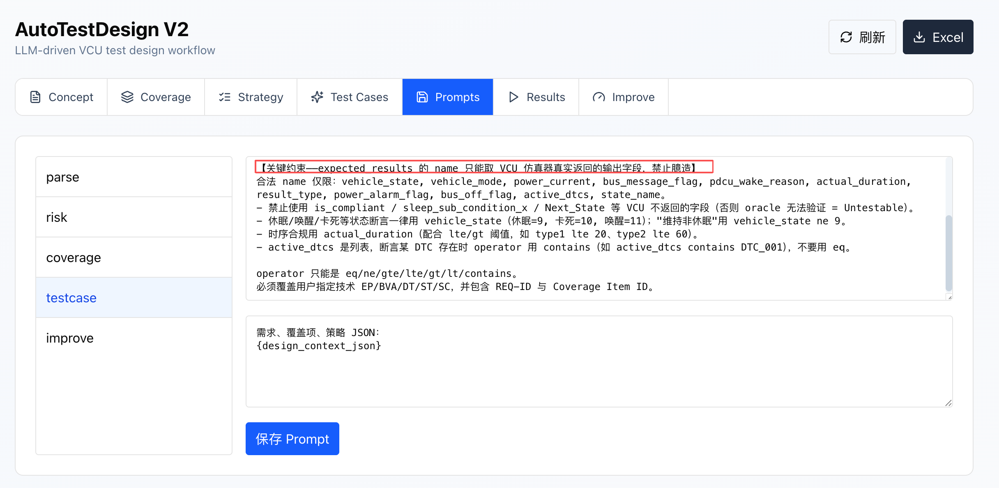

### 6.2 设计期测试用例审查

用例生成后，人工严格对照 Chp4TestTechPart1 的 EP/BVA 规则和 InspectionLiveSession 评审清单逐条审查。REV-012~015 的主要修订如下：

| REV | REQ/数量 | LLM 初版问题 | 人工修订 | 课件依据 |
|---|---|---|---|---|
| REV-012 | REQ-014 ×6 | oracle 用 `is_compliant`——VCU 不返回，**Untestable** | 改真实字段 `actual_duration`：type1 覆盖 lte20 的 19.9/20.0 和 gt20 的 20.1，type2 覆盖 lte60/gt60 | InspectionLiveSession P9 + BVA 三点 |
| REV-013 | REQ-012 ×2 | 标题"**不**触发卡死"却写 `result_type=stuck`+list 误用 eq | 改 `result_type ne stuck` + `vehicle_state ne 10` | Chp4Part1 P5 Incompletely specified conditions |
| REV-014 | REQ-001 +1 | BVA 缺 **invalid-too-low** 等价类，只覆盖 9.0/9.1，漏掉 8.9 | 新增 8.9V 用例，断言 `vehicle_state eq 9` | Chp4Part1 P35-40 BVA 必含无效类 |
| REV-015 | REQ-008/009/010 ×17 | oracle 用 `sleep_sub_condition_*`/`Next_State`，属于 **Untestable** | 改 prompt 加字段白名单形成 v2，并重生成三项需求，统一改用 vehicle_state | InspectionLiveSession P9 + Prompt Design |

**REV-015 量化效果**：重生成前全库 **21 条**引用 VCU 不存在字段，包括 is_compliant×6、sleep_sub_condition_*×16 和 Next_State×1。改 prompt 并 regenerate 后降为 **0 条**，该结果已由脚本扫描验证。

> 执行期审查 REV-016 由真实执行暴露，改 3、删 4、加 1，按时序归 §10.4。

### 6.3 Interactive Review 主索引

| REV | 阶段 | 修订摘要 | Before/After 证据所在 |
|---|---|---|---|
| REV-001~005 | 需求解析 | 删伪输入 / 时序双条件 / 维持分支 / 拆复合条件 / 条件式 oracle | **§2.2**，含 5 组截图 |
| REV-006~008 | 覆盖项 | +5 Output / +2 Behavior / +1 Environment，使覆盖项从 14 扩展到 22 | **§4**，含 CI 截图 |
| REV-009/010 | 风险 | REQ-008/009 RPN 8/6→2 Extensive | **§2.4**，含风险截图 |
| REV-011 | 策略 | 14 条需求补多技术绑定 | **§5.1**，前后表 |
| REV-012~015 | 用例设计期 | Untestable oracle 修正 + BVA 无效类 + 重生成 | **§6.3** + Prompt 截图 |
| REV-016 | 用例执行期 | 改 3、删 4、加 1 | **§10.4**，执行纠正链 |

> 完整逐条记录见 `review_log.md`，包括 Before/After 文件路径、原因、操作人、时间和 Phase 1~6。

---

## 7. Test Case Design

### 7.1 用例规模与构成
最终 reviewed 设计用例共 **96 条**，文件为 `09_test_cases_reviewed.json`：

| 技术 | 条数 |
|---|---|
| EP | 27 |
| BVA | 33 |
| DT | 13 |
| ST | 18 |
| SC | 5 |
| **合计** | **96** |

正向用例 49 条，期望成功唤醒到 state11 或休眠到 state9；负向用例 47 条，期望报错、拒绝、卡死或维持状态。

**分析**：技术分配与需求性质对口。7 路唤醒 REQ-001~007 都有电压或时序阈值，因此以 **BVA** 为主，每个边界覆盖 below、on、above 三点并包含无效类，同时辅以 EP 与 ST。3 条休眠条件 REQ-008~011 是布尔组合，用 **DT** 把 h1∧h2∧h3 的 2³=8 行全枚举。卡死 REQ-012 是多步时序序列，用 **SC** 场景和 ST 迁移覆盖；状态机贯穿用 **ST** 白盒覆盖。负向用例占 49%，这是刻意设计，因为测试目的之一就是发现 VCU 会报错、拒绝或卡死的场景，而不是把用例都做成 success。DEF-001 能被复现，也依赖这些负向和场景用例。BVA 必含**无效等价类**，例如供电 8.9V invalid-too-low，该点由 REV-014 对照课件 Chp4Part1 P35-40 补回。

### 7.2 每种技术样例

| 技术 | REQ | 输入 | 期望 Oracle |
|---|---|---|---|
| BVA | REQ-001 | voltage=9.1, duration=11 | vehicle_state=11, reason=1, expected, dur≤20 |
| EP | REQ-001 | voltage=12, duration=50 | vehicle_state=11, expected |
| ST | REQ-001 | voltage=12, duration=20 | vehicle_state=11, bus_message_flag=1, expected |
| DT | REQ-008 | VCUIdle_flg=1 | vehicle_state=9, expected |
| SC | REQ-012 | cycles=2, interval=0.9 | vehicle_state=11, expected；不触发卡死 |

### 7.3 用例版本链

| 版本 | 条数 | 含义 | 文件 |
|---|---|---|---|
| v0 | 88 | 首次 generate-all；REQ-014 因 502 bug 缺失 | `08_test_cases_raw_88_initial.json` |
| v1 | 94 | 修 502 后补全；这是人工审查前的纯工具输出，含 21 处臆造字段 | `08_test_cases_raw.json` |
| v2 | 96 | 字段白名单 + REV-012~015 设计期审查 | `09b_..._RECONSTRUCTED.json` |
| v3 | 99 | 通过 TOOL-FIX-007 加入取值语义后重生成，位于 REV-016 前 | `09a_..._before_REV016.json` |
| **v4** | **96** | v3 + REV-016 执行期审查，改 3、删 4、加 1 | **`09_test_cases_reviewed.json`** |

**分析**：主要 Before/After 是 v1 到 v4。v1 为工具初版，共 94 条，含 21 条不可验证字段；v4 为最终版本，共 96 条，0 条不可验证字段，且 96/96 通过。中间 v2/v3 完整保留，体现"两轮生成规则改进 + 两轮人工审查"的迭代闭环。测试用例并非一次性生成后直接采用，而是依据设计期审查和执行期反馈持续修订，详见 §6、§10.4 和 §12。

---

## 8. Traceability Matrix

全量追溯文件 `10_traceability_matrix.csv` 共 96 行，列结构为 `Test Case ID | Design Case UUID | Coverage Item ID | Requirement ID | Technique | RPN | Polarity | Result | Title`。每行可经 **Design Case UUID** join 到 `execution_details.json`，取得真实 VCU 输出，实现**需求 → 风险 RPN → 覆盖项 → 用例 → 执行结果**五级双向可追溯。

### 8.1 Traceability Summary

正文保留可读的追溯摘要，完整 96 行矩阵存放在 `10_traceability_matrix.csv`。该 CSV 保留完整 UUID，可直接 join 到 `execution_details.json` 查看每条用例的真实输入、期望输出、VCU 实际输出和 mismatch 信息。

| 技术 | 用例数 | 覆盖重点 | 结果 |
|---|---:|---|---|
| EP | 27 | 唤醒/休眠输入等价类、输出字段一致性 | 27/27 PASS |
| BVA | 33 | 电压、CAN ID、duration、actual_duration 边界 | 33/33 PASS |
| DT | 13 | h1/h2/h3 三条件组合与 bus flag 判定 | 13/13 PASS |
| ST | 18 | state09/state11/state10 状态迁移 | 18/18 PASS |
| SC | 5 | REQ-012 快速循环卡死场景 | 5/5 PASS |
| **合计** | **96** | **14 条需求、22 个覆盖项** | **96/96 PASS** |

最高风险 REQ-012 的 RPN 为 1，由 6 条用例追溯：1 条 ST 卡死迁移 + 5 条 SC 场景边界。其中 3 条稳定复现 DEF-001，表现为连续快速循环后进入 state10 并上报 DTC_001；其余 3 条用于隔离“不触发卡死”的边界条件。

### 8.2 覆盖完备性

- **需求 → 用例**：14/14 需求每条 ≥3 条用例；最少的是 REQ-013，共 4 条，最多的是 REQ-001/006/011，各 10 条。不存在孤儿需求。
- **覆盖项 → 用例**：22/22 Coverage Item 全部被覆盖；映射方法与追溯字段卫生披露见 §11.2。
- **用例 → 结果**：96/96 全部 PASS，每条经 UUID join 到 `execution_details.json` 的真实 VCU 输出。
- **极性分布**：47 条负向 / 49 条正向。负向 PASS 表示 VCU 正确报错、拒绝或复现卡死，语义见 §10.2。

> **追溯字段限制说明**：CSV 中 16 行的 `Coverage Item ID` 为占位串，例如 `EP-REQ-002`、`N/A` 或空值，原因是 v3 重生成时 UUID 链丢失。这些行仍可经 `REQ + 技术` 映射回 canonical CI，**不影响 22/22 覆盖结论**，并已在 §13 列为流程改进项。

---

## 9. Test Tool Implementation

- **框架**：pytest 9.0.3 + pytest-html + coverage.py 7.14，启用 `--branch`。
- **执行套件**：`tests/test_suite_from_design.py` 采用**数据驱动**方式，每个 pytest 参数对应一条设计用例，id 格式为 `UUID|REQ|RPN|title`。适配器 `_run` 把设计 in_data 翻译成 `VCUSimulator.simulate` 调用，并按 IEEE 829 生命周期执行 setup、驱动、断言和 teardown。用例按 RPN 升序执行。
- **工具执行链路**：TOOL-FIX-008 后，前端「执行全部」调用 `/api/execute`，再由 `pytest_runner.py` subprocess 执行 pytest，随后解析 JUnit XML 并按 case UUID 回映射，最终在前端 Results 显示真实通过率。
- **命令**：
  ```
  python -m pytest tests/test_suite_from_design.py --html=design_suite_report.html --junitxml=design_suite.xml
  coverage run --branch -m pytest tests/test_suite_from_design.py && coverage report --include="*/vcu_simulator/simulator.py"
  ```

---

## 10. Test Execution Results

执行命令 `python -m pytest tests/test_suite_from_design.py`，实测 **96 passed in 12.53s**；每条用例的 input、expected、VCU actual_output 和 mismatches 均写入 `execution_details.json`。

### 10.1 按测试技术统计通过率
| 技术 | Total | Passed | Failed | Pass Rate |
|---|---|---|---|---|
| EP 等价类 | 27 | 27 | 0 | 100% |
| BVA 边界值 | 33 | 33 | 0 | 100% |
| DT 决策表 | 13 | 13 | 0 | 100% |
| ST 状态迁移，白盒 | 18 | 18 | 0 | 100% |
| SC 场景 | 5 | 5 | 0 | 100% |
| **合计** | **96** | **96** | **0** | **100%** |

集成测试 `test_integration_http.py` 另 **11/11 通过**，覆盖 API 端到端路径，耗时 0.60s。

### 10.2 正向与负向用例构成
| 类别 | 数量 | 含义 | 通过即代表 |
|---|---|---|---|
| **正向** | **49** | 期望成功唤醒到 state11 或休眠到 state9 | VCU 在合法输入下正确进入目标态 |
| **负向** | **47** | 期望报错、拒绝、维持或卡死，其中 46 条 error、1 条卡死 | VCU 在非法、边界或缺陷输入下**正确报错或暴露缺陷** |

**分析**：负向用例占 49%，用于验证非法输入、边界条件和已知缺陷场景下的系统行为。负向用例 PASS 的含义是 VCU 按预期拒绝、报错、维持状态或复现缺陷，**而非返回 success**。例如 REQ-012 卡死用例 PASS 表示成功复现缺陷；CP=8V 负向用例 PASS 表示 VCU 正确拒绝唤醒并维持 state09。本轮无遗留失败，所有 oracle 偏差已在执行期审查修正，见 §10.4。

### 10.3 缺陷分析 DEF-001

按课件 `Chap5 Anatomy of a Perfect Bug Report` 三阶段法整理。

**Phase 1 — Investigation**：用 REQ-012 的 6 条用例做双维度边界隔离，其中 1 条 ST、5 条 SC，每条都有真实 VCU 输出：

| 用例 | cycles | interval | 触发卡死 | VCU 实际 vehicle_state / duration |
|---|---|---|---|---|
| SC | 2 | 0.9s | No | state11 / 14.7s |
| SC | 3 | 0.9s | Yes | **state10 / 41s + DTC_001** |
| SC | 4 | 0.9s | Yes | **state10 / 41s + DTC_001** |
| ST | 3 | 0.5s | Yes | **state10 / 41s + DTC_001** |
| SC | 3 | **1.0s 边界** | No | state11 / 14.7s |
| SC | 3 | 1.1s | No | state11 / 14.7s |

→ **隔离结论**：当且仅当 **循环次数 ≥ 3 且相邻间隔 < 1.0s** 时触发卡死。两个边界均被覆盖：次数 2 不触发，3 触发，对应阈值 `rapid_cycle_threshold=3`；间隔 0.9s 触发，**1.0s 不触发**，1.1s 不触发，对应阈值 `rapid_cycle_interval_s=1.0`，即"间隔≥1s 即重置计数"。

**Phase 2 — Synthesis**：`_handle_wake` 在累计 ≥3 次快速循环后把状态置为 `STATE_INIT`，对应 state10，而非 `STATE_RUN` 对应的 state11；同时上报 DTC_001、置 power_alarm=1、耗时拉到 41s。该状态在 Module A 内为**吸收态**，只能通过 reset 恢复。整车影响是：频繁开关门或 CAN 抖动即可让 VCU 卡死无法唤醒，现场需断电复位。

**Phase 3 — Polish：结构化缺陷报告**
```
Identifier:  DEF-001   Severity: Critical   Priority: P0   Status: Reproduced/Confirmed
Title:       连续≥3 次快速循环且间隔<1s 后，VCU 卡死于 state10 无法唤醒
Source:      REQ-012，客户文档已知缺陷；对应状态迁移 T5：state09→[Wake,rapid≥3]→state10
Expected:    理想设计下，第 4 次唤醒正常成功，vehicle_state=11, dur≈14.7s, 无 DTC
Actual:      实测复现 vehicle_state=10, result_type=error, active_dtcs=['DTC_001'],
                     actual_duration=41.0s, equal to stuck_est_time×2+1 and >40, power_alarm_flag=1
Root Cause:  vcu_simulator/simulator.py L164-176，_handle_wake 命中 rapid≥3 后进入 STATE_INIT
             + L198-200，_handle_sleep 仅当间隔≥1s 才重置计数，快速循环下会累加至 3
Recommended: 命中快速循环应进入可自恢复的退避/限流，而非吸收态 state10；或提供超时自动恢复
```
RPN=1 是最高优先级，原因是该缺陷触发门槛低且影响整车可用性。该缺陷由 REQ-012 的设计用例稳定复现，是本文档中测试结果分析的关键证据。

### 10.4 执行纠正链
将 96 条设计用例转化为数据驱动 pytest 后，暴露了部分设计期审查未能发现的偏差。每一步修订均先定位根因，再决定修改 prompt、adapter 或测试用例，避免仅为提高通过率而修改 oracle：


| 阶段 | 通过率 | 根因 / 动作 |
|---|---|---|
| 首次执行 | **48/96，50%** | 48 条 LLM oracle 系统性取值错误，包括 vehicle_state=0 幻觉、维持态写 10、no-wake 写 expected、卡死写 stuck |
| TOOL-FIX-007，prompt 取值语义 | **80/99，81%** | 根因在 prompt → 追加"VCU 输出取值语义"重生成，一次根治约 30 条 |
| 适配器修复，休眠先唤醒前置 | **92/99，93%** | 诊断出 13 条是**测试脚本 harness bug**。休眠测试需先唤醒到 state11 再施加条件，这不是设计缺陷 |
| REV-016，执行期人工审查 | **96/96，100%** | 改 3 条，涉及 REQ-010 输入矛盾、REQ-014 时序违规改走卡死路径；删 4 条，涉及 REQ-013 输出当输入×2、REQ-001 卡死重复、REQ-014 type2 无触发；加 1 条 8.9V invalid-low |

**关键结论**：执行期失败被区分为三类：① prompt 约束不足 → 修改 prompt 并重生成；② 测试脚本 harness bug → 修改 adapter，不误判为需求或 oracle 问题；③ 测试用例本身不合理 → 修正或删除。该分类保证修订动作与根因一致。

### 10.5 测试套件优化结论

AutoTestDesign 额外提供风险优先排序和 set-cover 最小化能力。全量 96 条按 RPN 升序执行，最高风险 REQ-012 卡死场景最先运行。最小化后得到 65 条冒烟回归套件，仍保持 14/14 需求和 65/65 覆盖单元不降，执行耗时从 12.56s 降到 5.62s，且 DEF-001 仍可复现。

本文最终验收仍以 **全量 96 条**为准；65 条套件只建议用于 CI 快速门禁。原因是最小化会牺牲少量分支覆盖，约从 89.0% 降到 86.6%，不适合作为完整交付证据。

---

## 11. Coverage Analysis

本节从三个层次度量覆盖：**需求覆盖 Requirement → 覆盖项覆盖 Coverage Item → 代码覆盖 Branch**，并补充白盒**状态迁移覆盖 All-States / All-Transitions**。所有数字由脚本从 `09_test_cases_reviewed.json`、`execution_details.json` 和 coverage.py 的 `coverage.json` 重算。

### 11.1 Requirement Coverage

下表按 RPN 升序列出全部 14 条 Module A 需求的用例分布与执行结果。RPN 越小代表风险越高，执行顺序也越靠前：

| REQ | RPN | 用例数 | Passed | 覆盖技术 | 风险等级 |
|---|---|---|---|---|---|
| REQ-012，卡死缺陷 | 1 | 6 | 6 | SC, ST | High |
| REQ-001，供电唤醒 | 2 | 10 | 10 | EP, BVA, ST | High |
| REQ-008，休眠 h1 | 2 | 5 | 5 | EP, DT, ST | High |
| REQ-009，休眠 h2 | 2 | 3 | 3 | EP, DT, ST | High |
| REQ-010，休眠 h3 | 2 | 6 | 6 | EP, DT, ST | High |
| REQ-011，h1∧h2∧h3 | 2 | 10 | 10 | EP, BVA, DT, ST | High |
| REQ-003，CP 唤醒 | 4 | 7 | 7 | EP, BVA, ST | High |
| REQ-002，CAN 唤醒 | 6 | 8 | 8 | EP, BVA, ST | Medium |
| REQ-004，CC 唤醒 | 6 | 7 | 7 | EP, BVA, ST | Medium |
| REQ-005，CC2 唤醒 | 6 | 7 | 7 | EP, BVA, ST | Medium |
| REQ-007，门板唤醒 | 6 | 8 | 8 | EP, BVA, ST | Medium |
| REQ-014，时序合规 | 6 | 5 | 5 | BVA | Medium |
| REQ-013，输出一致性 | 8 | 4 | 4 | EP, DT, ST | Medium |
| REQ-006，口盖唤醒 | 9 | 10 | 10 | EP, BVA, ST | Medium |
| **合计** | — | **96** | **96** | — | **14/14** |

**分析**：14/14 需求 100% 覆盖、96/96 PASS，无遗漏需求。用例数与风险**正相关**，RPN≤2 的 6 条 High 需求为 REQ-001/008/009/010/011/012，合计 40 条用例，占 42%，说明测试资源向高风险需求倾斜，符合 risk-based testing。每条需求至少由 1 种黑盒技术覆盖，状态机相关需求 REQ-001~012 额外有白盒 ST 覆盖。风险门槛已达成：High 需求 RPN≤5 的用例 **47/47=100%** 通过，Medium 需求 RPN 6~10 的用例 **49/49=100%** 通过，满足 PROJECT_PLAN §STP-6.3 的"High 风险需求 100% 必过"。

### 11.2 Coverage Item Coverage

§4 中定义的 22 条 canonical Coverage Item 按 `需求 + 技术` 映射到覆盖它的用例数。同一 req + 技术下的多个 CI 由该组用例共同覆盖：

| # | REQ | 技术 | 覆盖用例数 | Coverage Item | Status |
|---|---|---|---|---|---|
| 1 | REQ-001 | BVA | 4 | 硬线供电唤醒边界值 | Pass |
| 2 | REQ-001 | EP | 5 | vehicle_state oracle 一致性 | Pass |
| 3 | REQ-001 | EP | 5 | pdcu_wake_reason 来源编码 oracle | Pass |
| 4 | REQ-001 | EP | 5 | VCU v1.0 SIL 环境基线 | Pass |
| 5 | REQ-001 | ST | 1 | 正常唤醒序列 state09→state11 | Pass |
| 6 | REQ-002 | BVA | 4 | CAN 报文 ID 边界 | Pass |
| 7 | REQ-003 | BVA | 3 | CP 信号电压边界 | Pass |
| 8 | REQ-004 | BVA | 3 | CC 信号电压边界 | Pass |
| 9 | REQ-005 | BVA | 3 | CC2 信号电压边界 | Pass |
| 10 | REQ-006 | BVA | 6 | 口盖电压+时间边界 | Pass |
| 11 | REQ-007 | BVA | 3 | 门板电压+时间边界 | Pass |
| 12 | REQ-008 | EP | 2 | 休眠 h1 等价类 | Pass |
| 13 | REQ-009 | EP | 1 | 休眠 h2 等价类 | Pass |
| 14 | REQ-010 | EP | 2 | 休眠 h3 CAN 空闲 | Pass |
| 15 | REQ-011 | DT | 8 | 三条件组合判定表 | Pass |
| 16-18 | REQ-012 | SC | 5 | 卡死场景 / DTC_001 / 卡死序列，共 3 条 CI | Pass |
| 19 | REQ-013 | DT | 1 | bus_message_flag↔vehicle_state | Pass |
| 20 | REQ-013 | ST | 1 | 电源状态↔总线标志位迁移 | Pass |
| 21-22 | REQ-014 | BVA | 5 | 响应时序合规 / actual_duration 边界，共 2 条 CI | Pass |

**Coverage Item Coverage = 22/22 = 100%**，技术覆盖 EP/BVA/DT/ST/SC 五种齐全，包括 4 种黑盒技术和 1 种白盒技术。

**追溯链限制说明**：22 条 CI 中有 21 条可由用例 `coverage_item_id` UUID 直接 join。其余 1 条是 #19 区的 REQ-012「active_dtcs 含 DTC_001」，在 v3 重生成时丢失 UUID 链，但功能上仍被 REQ-012 的 6 条卡死用例覆盖，每条都断言 `active_dtcs contains DTC_001`，故按 req+技术映射仍为已覆盖。另有 16 条 v3 重生成用例的 `coverage_item_id` 为占位串。**此为追溯字段一致性问题，不影响 22/22 覆盖结论**，已列为流程改进项。

### 11.3 Branch Coverage

本节度量白盒代码覆盖，被测代码为 `vcu_simulator/simulator.py`。工具为 coverage.py 7.14，启用 `--branch`。测试来源为 `tests/test_suite_from_design.py`，共 96 条进程内驱动 `VCUSimulator` 的用例。

| 指标 | 纯 Module A 逻辑 | Chap5 Master Test Plan 退出准则 | 结果 |
|---|---|---|---|
| **语句覆盖** | **95.8%，160/167** | ≥ 80% | Pass, exceeds by +15.8pp |
| **分支覆盖** | **89.0%，73/82** | ≥ 70% | Pass, exceeds by +19.0pp |

**度量方法**：`simulator.py` 是 Module A/B/C/D/E **共享文件**，文件级原始覆盖率为语句 76.6%，即 180/226；分支覆盖率为 70.4%，即 76/108。因本 Artifact **只测 Module A**，需把非-Module-A 代码从分母剔除后再算。剔除明细如下：

| 被剔除部分 | 所属 | 理由 |
|---|---|---|
| `_handle_guard_rejection`，过压→fault+DTC_002 / 欠压→undervoltage_shutdown+DTC_003 | Module B | REQ-015/016，非 Module A |
| `can_error_count` 注入，L40 | Module C | CAN 错误 REQ-019 |
| `reset(clear_dtc=True)` 清码，L99 | Module D | DTC 清除 REQ-022 |
| `get_state/get_config/update_config/get_performance/_deep_update` | 基础设施/API | 查询配置接口，非测试目标；用例直接调 `simulate()` |
| `simulate_sleep / simulate_batch` | 旧接口 | legacy 包装，数据驱动用例不走 |
| `_normalize_legacy_payload`，L372-389 | 旧接口 | 旧 signal_name 兼容，新用例用 kwargs 不触发 |

剔除 59 条非-A 语句 + 26 条非-A 分支后，**纯 Module A 决策逻辑** = 95.8% / 89.0%。

**Module A 内仍未覆盖的 7 行分析**：行号为 L155, L202, L273, L304, L330, L333, L358。
- **L155**：处于 fault/undervoltage 时拒绝唤醒——需先经 Module B 进入故障态，跨模块，本范围不构造；
- **L202**：休眠时功耗不达标置 power_alarm——Module E 功耗告警分支；
- **L273**：无任何有效唤醒信号的 fallthrough。该缺口已在 §12 基于覆盖证据新增用例补上，使纯 Module A 覆盖升至 96.4% / 90.2%。
- **L304/330/333/358**：`test_status` 次要赋值、fault/undervoltage 的 state 映射、stuck 电流次要分支，均为边界或相邻模块联动，不影响 Module A 主决策路径的覆盖。主路径包括 7 路唤醒、3 条件休眠、卡死和输出一致性。

**结论**：Module A 主决策逻辑覆盖充分，语句覆盖 95.8%、分支覆盖 89.0%，均远超退出准则。未覆盖的 6~7 行集中在"相邻模块联动 / 次要赋值"，属可接受残余风险，已在 §13 记录。证据包括 `coverage.json` 的精确指标、`coverage_html/` 的逐行高亮和 `coverage_report.txt`。

### 11.4 State Transition Coverage

本节给出白盒 FR 4.0 的状态迁移覆盖。Module A 状态机包含三态：**state09 为休眠初始态，state11 为唤醒态，state10 为卡死吸收态**。按课件 Chp4TestTechPart2 p26 构造**完整状态转换表**，包含四字段，并将不可能组合标为 Undefined。3 状态 × 5 事件共 15 行，节选定义迁移如下：

| Current State | Event/cond | Action | New State |
|---|---|---|---|
| state09 | Wake[有效, rapid<3] | 唤醒成功 reason1-7 | **state11** |
| state09 | Wake[有效, **rapid≥3**] | DTC_001 卡死, dur=41s | **state10** |
| state09 | Wake[无效] | 保持休眠, error | state09 |
| state11 | Sleep[h1∧h2∧h3] | 进入休眠 | **state09** |
| state11 | Sleep[不全] | 保持唤醒，vehicle_state ne 9，result_type=error | state11 |
| state11 | Wake[有效, rapid≥3] | **Undefined**。该组合不可达，卡死迁移只能从 state09 触发 | Undefined |
| state10 | 任意事件 | **Undefined**。这是吸收态，需 reset 恢复，已越过 Module A 范围 | Undefined |

**设计迁移 T1~T5 与 ST 用例映射**：覆盖目标为 All-Transitions / 0-switch。

| Transition | From → To | 触发 | ST 用例数 |
|---|---|---|---|
| T1 | state09 → state11 | Wake[有效] w1~w7 | 8 条，覆盖 REQ-001~007 + REQ-013 |
| T2 | state09 → state09 | Wake[无效] | 4 条，覆盖 REQ-003/004/005/007 负向 |
| T3 | state11 → state09 | Sleep[h1∧h2∧h3] | 4 条，覆盖 REQ-008~011 |
| T4 | state11 → state11 | Sleep[不全] | 1 条，覆盖 REQ-011 负向 |
| T5 | **state09 → state10** | Wake[rapid≥3] | 1 条，覆盖 REQ-012 |

**覆盖结论**：
- **All-States = 3/3 = 100%**，state09/10/11 均被访问。
- **All-Transitions / 0-switch = 100%**，T1~T5 全覆盖，18 条 ST 用例全 PASS。
- REQ-012 卡死序列 `state09→11→09→11→09→11→09→10` 额外提供 **1-switch 序列覆盖**，对应课件 N-1 Switch。

**表格强制发现的洞见**：枚举到 `state11 × Wake[rapid≥3]` 时发现其**不可达**。卡死迁移 T5 只能从 state09 触发，因为计数累积发生在休眠侧，从而精确定位了 DEF-001 的触发源态。这正是状态转换表"强制考虑易遗漏组合"的价值。

---

## 12. Evidence-based Improvement

> **范围界定**：Assignment「Mainly」清单中 **#7 基于证据的改进**排在 **#6 结果分析**之后，本文将其解释为用例执行并获得执行/覆盖证据之后新增的有效用例。因此本节只收录第一轮执行后的有效新增，来源分为两类。设计期改进包括 CI 14→22、prompt 迭代、不可验证字段 21→0，已在 §4 和 §6 说明；执行纠正链 48→96 已在 §10.4 说明。

### 12.1 来源 A：第二轮 LLM 用例增广

第一轮 96/96 执行完成后，将执行结果和覆盖信息输入 `/api/improve` 的 `improve` prompt。模型为 qwen3.7-max，调用耗时 67s，得到 **8 条**增广建议。测试人员随后对照 `simulator.py` 的实际行为逐条评审，最终采纳 **3 条**，采纳率为 37.5%：

| # | REQ | 建议 | 人工评审结论 |
|---|---|---|---|
| 3 | REQ-011 | 休眠条件全满足 + 同时来唤醒 | 采纳，修正 oracle：LLM 建议 state11，实际 `simulate` 先判 `_has_sleep_inputs`，因此休眠优先，期望 state9 |
| 5 | REQ-004 | CC 与 CC2 同时满足唤醒 | 采纳，修正 oracle：LLM 建议 `reason in[4,5,6]`，但该操作符不支持；实际 CC 优先于 CC2，期望 reason 4 |
| 8 | REQ-006 | 口盖超长时序 5000ms | 采纳，oracle 与仿真器行为一致 |
| 1 | REQ-001 | 电压跌落致防抖重置 | 拒绝：SUT 未建模防抖重置，无法输入 voltage_profile |
| 2 | REQ-002 | CAN Bus-Off 下唤醒 | 拒绝：超出 Module A 范围，并引用 SUT 不存在的 `DTC_CAN_BUS_OFF` |
| 4 | REQ-012 | state10 卡死后唤醒屏蔽 | 未采纳：与 DEF-001 覆盖目标重叠，且 setup 复杂 |
| 6 | REQ-014 | NM 报文刷新休眠计时器 | 拒绝：SUT 无 NM keep-awake 机制 |
| 7 | REQ-009 | 认证超时降级 | 拒绝：引用 SUT 不存在的 state12 和 `DTC_AUTH_TIMEOUT` |

**评审价值**：5 条建议因"SUT 未建模 / 超出 Module A 范围 / 引用不存在的 DTC 或状态"被拒绝；2 条被采纳建议的 oracle 经人工修正后才进入执行。该过程说明增广建议需要经过需求范围、SUT 行为和 oracle 可执行性的复核。

**3 条采纳用例在 VCU 上重跑**：3/3 通过，VCU 行为印证了人工修正后的 oracle。

| 用例 | 输入 | VCU 实际输出 | 通过 | 验证的新行为 |
|---|---|---|---|---|
| REQ-011/SC | h1=h2=h3=1, voltage=12 | vehicle_state=**9**, reason=0, expected | Pass | 并发场景下，**休眠优先于唤醒** |
| REQ-004/SC | cc=2.0, cc2=2.0 | vehicle_state=11, pdcu_wake_reason=**4**, expected | Pass | **CC 优先于 CC2** |
| REQ-006/BVA | hood=4.1, dur=5000 | vehicle_state=11, reason=6, expected | Pass | 超长时序无溢出 |


实测与**人工修正后**的 oracle 完全一致，分别为 state9、reason4 和 reason6，说明原始建议中的部分 oracle 需要人工校正。**有效性说明**：新增 3 条组合/优先级条件，但**分支覆盖 +0**，仍为 76.65%。这是因为优先级属于判定顺序行为，执行路径已在基线用例中覆盖，分支覆盖对该类行为不敏感。

### 12.2 来源 B：覆盖缺口驱动

依据 §11.3 覆盖分析证据，`simulator.py` **L273 未覆盖**，该行是 `_detect_wake_reason` 末尾的 `return 0, ""`，代表"无任何有效唤醒信号"的 fallthrough。针对该缺口，新增 1 条用例：**「无唤醒信号 → 维持 state9，result_type=error」**。该用例属于 7 路唤醒需求的负向等价类，第一轮 96 条按单信号设计而遗漏。重跑结果：

| 指标 | 96 基线 | 96+新增 | Δ |
|---|---|---|---|
| 新覆盖行 | — | **恰为 L273**，由脚本 diff 确认 | — |
| 纯 Module A 语句覆盖 | 95.8% | **96.4%** | +1 行 |
| 纯 Module A 分支覆盖 | 89.0% | **90.2%** | +1 弧 |

### 12.3 结论
§12 收录 **2 类来源、4 条执行后新增有效用例**，且 4/4 通过。第一类是 **LLM 增广**，采纳 3 条，采纳率 37.5%，主要新增组合/优先级用例；5 条超出范围或不可执行的建议被拒绝，2 条 oracle 被修正，分支覆盖 +0。第二类是 **覆盖缺口驱动**，针对 L273 新增 1 条，可量化地将纯 Module A 分支覆盖从 **89.0% 提升到 90.2%**。
**结论**：分支覆盖必要但不充分。组合/优先级盲区可由增广建议提示，但必须经过人工复核；代码路径盲区则依赖覆盖分析定位。两类证据互补，构成本文的基于证据改进结果。

---

## 13. Limitations and Residual Risks

本文以目标应用 Module A 的测试设计与执行为核心，因此 AutoTestDesign 工具自身的性能 NFR 仅作为背景证据保存在 `nfr_performance.md`，不放入主结论。主文档的残余风险集中在被测 VCU 仿真器和本次测试范围：

- **SUT 限制**：SIL 级仿真，无真实 HIL/dSPACE/CAN 物理层/1kHz 采样；本 Artifact **仅测 Module A**。Module B/C/D/E 不属于本文测试范围，它们包括过压/欠压保护、CAN 错误、DTC 清除和功耗告警，详见 §1.3。
- **残余覆盖风险**：Module A 仍有 6 行未覆盖，行号为 L155/202/304/330/333/358，详见 §11.3。这些行集中在"相邻模块联动 / 次要赋值"，需进入故障态或跨模块才能触达，属可接受残余风险。
- **追溯链卫生**：16 条 v3 重生成用例 CI 字段为占位串，详见 §11.2。该问题不影响覆盖结论；后续应在生成阶段强制 CI UUID 回填，避免依赖 `REQ + 技术` 回映射。
- **已知缺陷状态**：DEF-001 已稳定复现并确认，但本文只完成测试证明和缺陷分析，不修改 SUT 业务逻辑；修复后需要用 REQ-012 的 ST/SC 用例重新回归。

---

## Appendix A — 证据文件索引

| 类别 | 文件 |
|---|---|
| 需求 | `module_A_requirements_input.csv`、`01_parsed_requirements_raw.json` |
| 覆盖项 | `_state_snapshot/coverage_items.json`、`coverage_tables.md` |
| 风险 | `06_risk_analysis_reviewed.json/.csv` |
| 策略 | `07_strategy_assignment.csv` 和 `_before` 版本 |
| Prompt | `prompts_used.md`、`prompt_testcase_v1/v2/v3*.json` |
| 用例 | `09_test_cases_reviewed.json`，以及版本链 08/09a/09b |
| 追溯 | `10_traceability_matrix.csv` |
| 执行 | `pytest_output/`，包含 design_suite.xml/html/txt、execution_details.json、integration_http 和 coverage* |
| 缺陷 | `defect_DEF-001_state10_stuck.md` |
| 通过率 | `pass_rate_summary.md` |
| FR5 oracle | `FR5_oracle_evidence.md`、`FR5_oracle_samples.csv` |
| FR7 优化 | `fr7_optimization.md`、`fr7_optimization/*.json` |
| §12 改进 | `improvement_evidence.md`、`improve_round2_*.json` |
| NFR | `nfr_performance.md` |
| 审查记录 | `review_log.md`，覆盖 REV-001~016 和 TOOL-FIX-001~008 |
| 截图 | `screenshots/`，共 20 张，覆盖服务、Swagger、前端、各 REV before-after、风险和 prompt |

---
**End of Artifact 4 Document**
